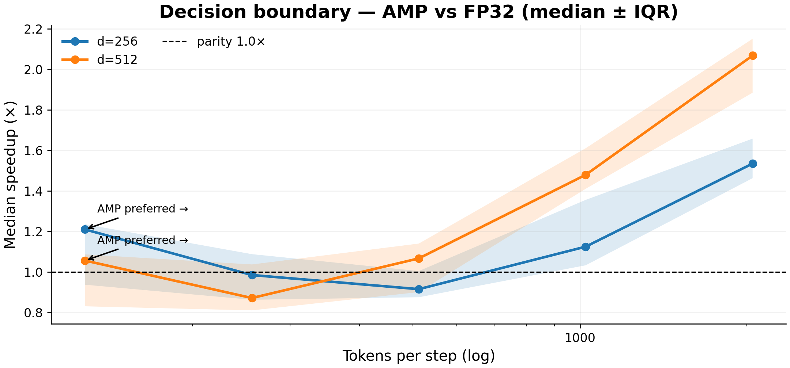
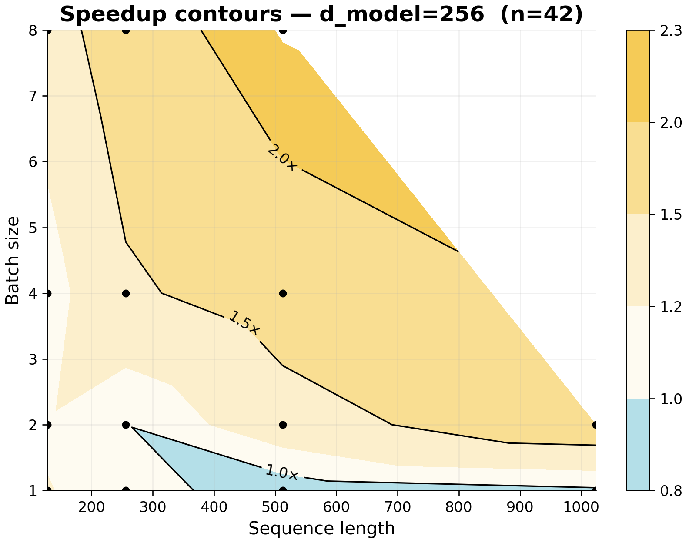
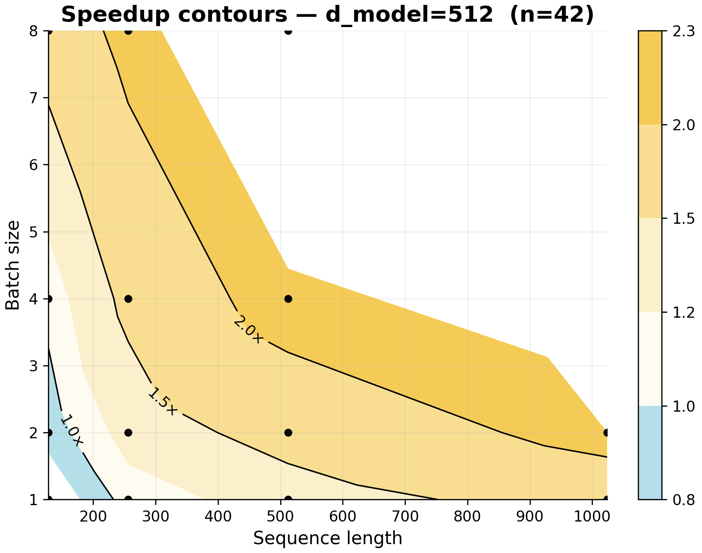

# AMP vs FP32 on NVIDIA T4 — When Is Mixed Precision Faster?

## Research Questions

1. Can Automatic Mixed Precision (AMP, FP16) be faster than FP32 on a single NVIDIA T4 (SM 7.5)?
2. How do model width (d_model), batch size, and sequence length (tokens per step) change the AMP↔FP32 crossover point?

### Decision Boundary — AMP vs FP32



*Median ± IQR crossover from near-parity to clear AMP wins. Wider models (d_model = 512) cross earlier because they do more work per token.*

#### Speedup Contours — d_model = 256



*For d_model = 256, AMP helps later, but can reach ~2.0× at larger batch/sequence sizes.*

#### Speedup Contours — d_model = 512



*For d_model = 512, AMP starts winning earlier (~600 tokens/step) and keeps improving as workload grows.*

## Experiment Design

We compared FP32 vs AMP on a T4 with a GLM4-MoE model across a grid of shapes.

- **Hardware:** Tesla T4 (SM 7.5)  
- **Model:** GLM4-MoE (top-2 routing)  
- **Precisions:** FP32 vs AMP (PyTorch AMP)

### Grid

- Layers: **4 / 8 / 12**
- Width: **d_model 256 / 512**
- Batch size: **1 / 2 / 4 / 8**
- Sequence length: **128 / 256 / 512 / 1024**

### Metrics & Protocol

- Step time via **CUDA events**; power via **NVML**, normalized per effective step  
- If a shape **OOM’d**: base → checkpoint → grad_accum=2 → halve batch → halve seqlen  
- Compare **exact-shape pairs only** (same final shape for AMP and FP32)

**Why tokens/step?**
`tokens_per_step = batch_size × seqlen` (per device). More tokens per step keeps the GPU busier and makes AMP’s kernels pay off.

## Usage

```bash
# Run the notebook (Colab or local with a T4):
#   exp4_amp_fp32_t4/notebook.ipynb

# Outputs:
#   exp4_amp_fp32_t4/results/full_data.csv
#   exp4_amp_fp32_t4/results/pairs_analysis.csv

# Figures referenced by this README (relative paths):
#   exp4_amp_fp32_t4/decision_boundary.png
#   exp4_amp_fp32_t4/speedup_contours_d256.png
#   exp4_amp_fp32_t4/speedup_contours_d512.png
````

## Results

### Training Configuration

- Hardware: Tesla T4
- Architecture: GLM4-MoE
- Repeats: **3 warmups / 5 timed runs per point**

### Performance Summary

- **Decision boundary:** AMP pulls ahead at **≈600–1,000 tokens/step**, earlier for **d_model = 512**.
- **d_model = 256:** wins arrive later, but can reach **~2.0×** at larger batch/sequence sizes.
- **d_model = 512:** crosses earlier (~600 tokens/step) and improves steadily as workload increases.

## Key Findings

1. **When AMP beats FP32 on T4**
   Around **~1k tokens per step** (batch_size × seqlen, per device), AMP is consistently faster. The **crossover range is ≈600–1,000 tokens/step**, with earlier wins for **d_model = 512**.

2. **How width, batch size, and length affect crossover**
   Increasing **tokens per step** moves you into the AMP-friendly regime. **d_model = 256** needs more tokens to benefit; **d_model = 512** reaches parity earlier and scales well beyond ~600 tokens/step.

3. **Auto-trainer rules (T4, simplified)**

   - Compute `tokens_per_step = batch_size × seqlen` (per device).
   - Choose precision:

     - If `d_model ≥ 512` **and** `tokens_per_step ≥ 600` → **AMP**
     - Else if `tokens_per_step ≥ 1000` → **AMP**
     - Else → **FP32**

   **Examples**

   - `bs=4, seqlen=256` → 1024 tokens/step → **AMP**
   - `bs=2, seqlen=256, d_model=512` → 512 tokens/step → **FP32** (below 600)
   - `bs=2, seqlen=320, d_model=512` → 640 tokens/step → **AMP**

> **Limitations:** Calibrated on T4 with GLM4-MoE. Different models/kernels, dynamic shapes, or slow input pipelines can shift these breakpoints. Treat **600/1000** as practical defaults.

### Answer to Research Questions

**Q1: Can AMP be faster than FP32 on a single T4?**
**Yes.** AMP is consistently faster once you reach **≈600–1,000 tokens/step**, with earlier crossover for **d_model = 512**.

**Q2: How do width, batch size, and sequence length shift the crossover?**
They change **tokens per step**. More tokens per step favors AMP; wider models need fewer tokens to cross parity.

## Files

- `notebook.ipynb` — reference notebook (Colab)
- `decision_boundary.png` — AMP vs FP32 crossover visualization
- `speedup_contours_d256.png` — contours for **d_model = 256**
- `speedup_contours_d512.png` — contours for **d_model = 512**
- `results/full_data.csv` — full run data
- `results/pairs_analysis.csv` — exact-shape pairing summary/deltas
