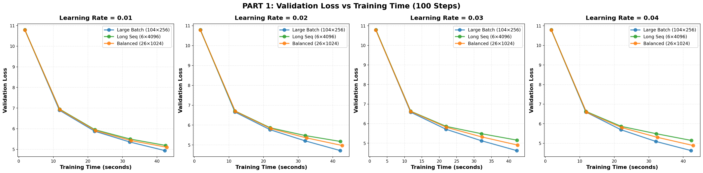
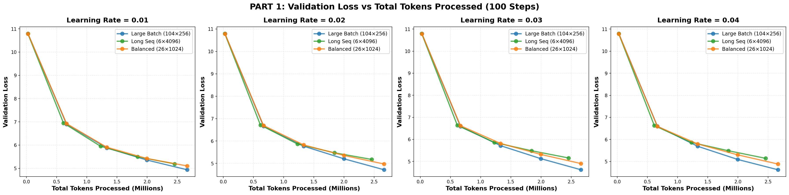
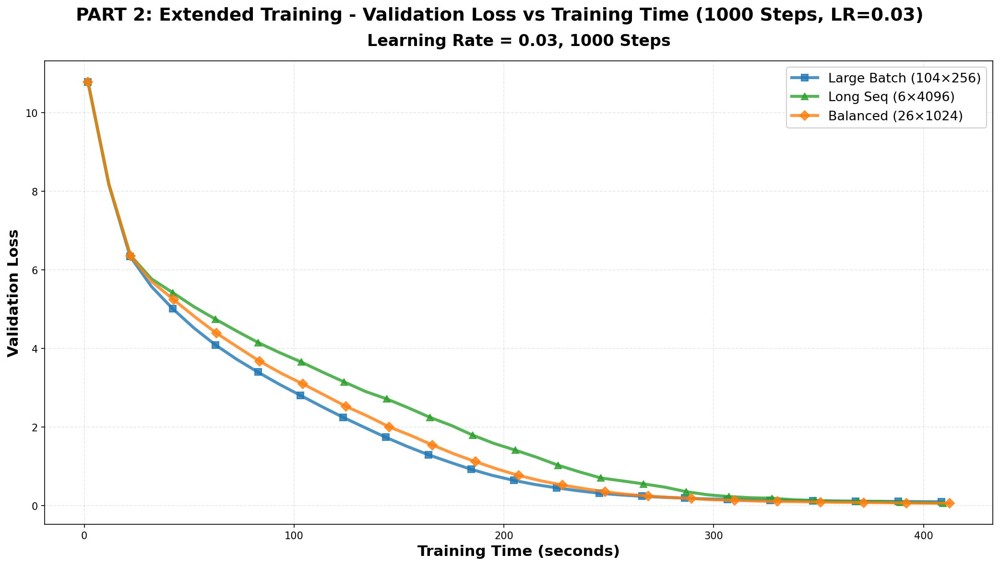
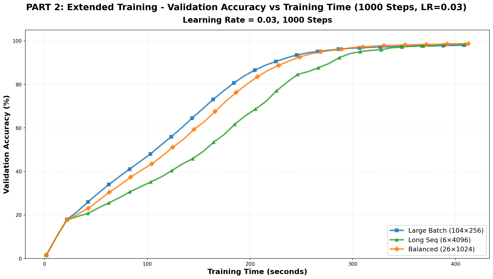

# Experiment 5: Batch Size vs Sequence Length Ablation Study

📺 **Tutorial Video**: [Watch on YouTube](https://youtu.be/bu5dhaLmr7E)

## Overview
Two-part experiment investigating the trade-off between batch size and sequence length in MoE transformer training.

**Variables**: Batch size, sequence length, learning rate

## Part 1: Learning Rate Comparison (100 steps)

Tested 12 configurations across 4 learning rates (0.01, 0.02, 0.03, 0.04), goal is to fill the GPU memory:
- **Large Batch**: 104 × 256 [batch_size x seq_len](prioritize batch size)
- **Long Sequence**: 6 × 4096 (prioritize sequence length)
- **Balanced**: 26 × 1024 (middle ground)

### Results

**Finding**: LR=0.03 emerged as optimal across all strategies.

## Part 2: Extended Training (1000 steps, LR=0.03)

Extended the best learning rate for 10x more steps to observe long-term convergence.

### Results

### Final Performance

| Strategy | Val Loss | Val Accuracy | Training Time |
|----------|----------|--------------|---------------|
| **Balanced** | **0.0636** | **98.73%** | 7.04 min |
| Long Seq | 0.0745 | 98.45% | 6.99 min |
| Large Batch | 0.1025 | 98.00% | 6.97 min |

## Important Caveat

While the results show that large batch size trains faster than long sequence length in terms of validation loss, it's important to note that **longer sequences provide more context** and should theoretically enable the model to learn more complex patterns over time. Validation loss alone may not capture the full picture of model capability.

Future Work should contain more benchmarks and evaluation.

The current validation loss metric may favor faster convergence but doesn't necessarily reflect the model's ability to leverage extended context windows.