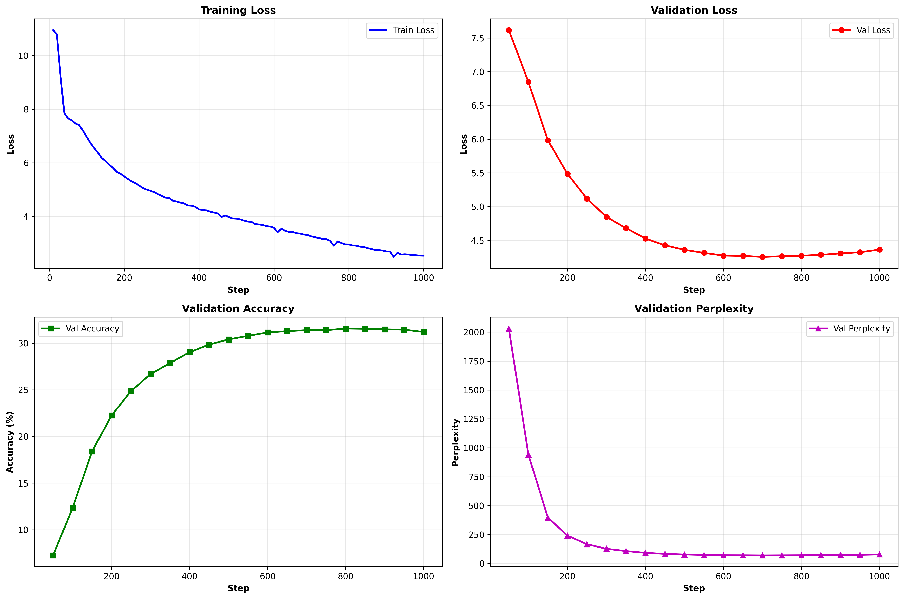

# Experiment 6: Gated DeltaNet Training

## RTX 4090 LR Ablation (200 steps)

| LR | Val Loss | Val Acc | Perplexity |
|---|---|---|---|
| 3e-4 | 7.100 | 11.2% | 1212 |
| 5e-4 | 6.354 | 16.0% | 645 |
| **1e-3** | **6.161** | **17.7%** | **474** |
| 1.5e-3 | 6.250 | 16.5% | 518 |
| 2e-3 | 6.271 | 16.8% | 529 |

**Best:** 1e-3

## Full Training (1000 steps, LR=1e-3)

**Config:** 188.98M params, batch=32, seq_len=1024, 70M tokens (no repetition)

**Results:**
- Best Val Loss: **4.253** (step 700)
- Final Val Acc: **31.20%**
- Final Perplexity: **78.38**
- Training Time: 7.21 min

**Run:** `python run_experiment.py --config rtx4090`
