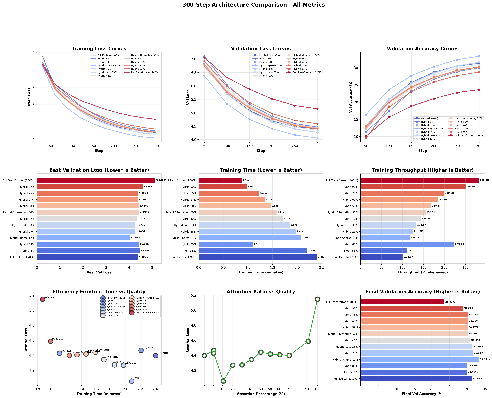

# Experiment 7: Hybrid DeltaNet Architecture Ablation (H100)

Ablation study testing 13 architectures (0-100% attention) to find the optimal DeltaNet/Attention hybrid ratio for language modeling.

Experiments are not exhaustive, but there is a strong base to continue experimentation.

**📺 Video Overview:** [Watch on YouTube](https://www.youtube.com/watch?v=tf3ESMqDOTY)

---

## 🏆 Winner: Hybrid Sparse 17%

**Configuration:**
```python
# Use get_h100_hybrid_sparse() from config.py
layers: [5, 11]           # 2 attention out of 12 layers (17%)
learning_rate: 0.002      # Hybrids need higher LR than pure DeltaNet (0.001)
```

**Why it works:**
- **Layer 5 (mid-network):** Captures intermediate representations
- **Layer 11 (near-output):** Refines high-level features before prediction  
- **10 DeltaNet layers:** Efficient O(n) processing with strong inductive bias

**Performance:**
- Val loss: 4.055 (best of 13 architectures)
- 27% better than pure Transformer (worst: 5.146)
- 8% better than pure DeltaNet (5th: 4.396)
- Throughput: 118K tokens/sec

---

## Results Summary

### Phase 1: Learning Rate Ablation (200 steps, 9.8M tokens)


DeltaNet prefers LR 1e-3, Hybrids/Transformer prefer LR 2e-3

### Phase 2: Architecture Comparison (300 steps, 14.7M tokens)


**Top 5:**
1. 🥇 Hybrid Sparse 17% - 4.055
2. 🥈 Hybrid 25% - 4.266
3. 🥉 Hybrid Late 33% - 4.272
4. Hybrid 42% - 4.342
5. Full DeltaNet 0% - 4.396
13. ❌ Full Transformer 100% - 5.146

**Key Findings:**
- Sweet spot: 17-33% attention (all top 3)
- Pure architectures fail (Transformer worst, DeltaNet mediocre)
- Strategic layer placement > total attention percentage
- DeltaNet provides better sample efficiency than pure attention

---

## Commands

**LR Ablation (Phase 1)**
```bash
python run_lr_ablation_h100.py
```

**Architecture Mixture Ablation (Phase 2)**
```bash
python run_full_architecture_comparison.py
```

**Train individual architecture**
```bash
python run_experiment.py --experiment h100_deltanet
python run_experiment.py --experiment h100_transformer
python run_experiment.py --experiment h100_hybrid_sparse
python run_experiment.py --experiment h100_hybrid_alternating
python run_experiment.py --experiment h100_hybrid_late
```

**Resume/extend training**
```bash
python run_experiment.py --experiment h100_deltanet --resume checkpoints_h100_deltanet/best_model.pt
python run_experiment.py --experiment h100_deltanet --resume checkpoints_h100_deltanet/best_model.pt --extend-steps 5000
```

**Compare & benchmark**
```bash
python compare_experiments.py
python ../../benchmarks/arc_challenge.py --checkpoint checkpoints_h100_deltanet/best_model.pt
```

## Architectures Tested

### Pure Architectures
- **h100_deltanet (0%)**: Pure DeltaNet - O(n) complexity
- **h100_transformer (100%)**: Pure attention - O(n²) complexity

### Hybrid Architectures (DeltaNet + Attention Mix)
- **h100_hybrid_8 (8%)**: 1/12 layers attention (last layer only)
- **h100_hybrid_sparse (17%)**: 2/12 layers attention [5, 11]
- **h100_hybrid_25 (25%)**: 3/12 layers attention [4, 8, 11]
- **h100_hybrid_late (33%)**: 4/12 layers attention [8, 9, 10, 11]
- **h100_hybrid_42 (42%)**: 5/12 layers attention [2, 4, 6, 8, 11]
- **h100_hybrid_alternating (50%)**: 6/12 layers attention (every other)
- **h100_hybrid_58 (58%)**: 7/12 layers attention
- **h100_hybrid_67 (67%)**: 8/12 layers attention
- **h100_hybrid_75 (75%)**: 9/12 layers attention
- **h100_hybrid_83 (83%)**: 10/12 layers attention
- **h100_hybrid_92 (92%)**: 11/12 layers attention (all but first)

## Reference

### Model Configuration (H100)
- **Base**: 768d × 12L × 12H (~188M-302M params)
- **Sequence**: 1024 tokens, batch 48 = 49,152 tokens/step
- **Training scales**: 200 steps (9.8M), 300 steps (14.7M), 700 steps (34.4M)
- **Learning rates**: DeltaNet 1e-3, Hybrids/Transformer 2e-3
